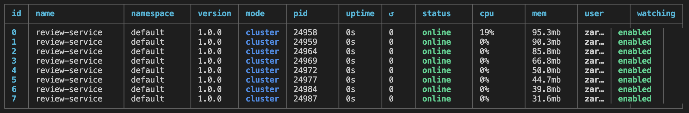

# Edu Backend

A simple Node.js + TypeScript app managed with PM2.

`review-service` run in Cluster mode consists of:/

- API to query all sugggestions for feedback
- API to submit feedback from client
- API to query all the feedbacks

 ## Screenshots



## Run the app

1. Install all the dependencies in the roote directory and also `review-service` directory.

```
$ npm install
$ cd review-service
$ npm install
```

2. Add the `.env` file to the project. Follow the `.env.template` format.

```
PORT=8000
```

3. Runs the app in the development mode.

```
$ npm start
```

3. You can make changes and reload.

```
$ npm run reload
```

3. To monitor logs.

```
$ npm run monitor
```